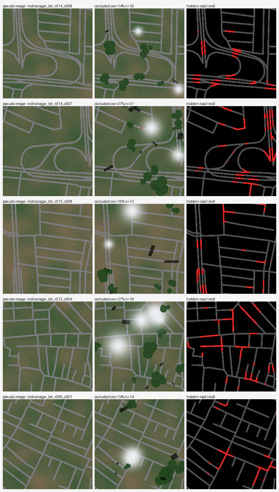
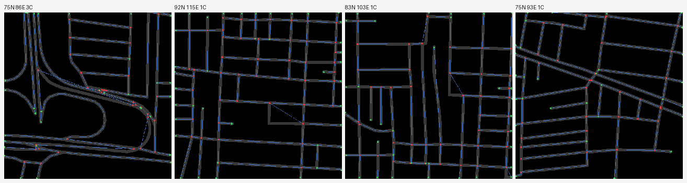
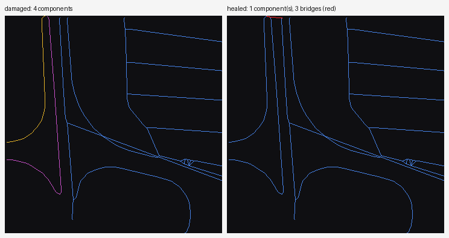
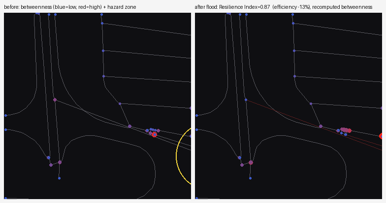

# Route Resilience

**Occlusion-Robust Road Extraction & Graph-Theoretic Criticality Analysis for Urban Mobility**
Bharatiya Antariksh Hackathon 2026 (ISRO × Hack2skill) · NNRMS mandate.

Standard road segmentation breaks wherever a road is hidden — tree canopy,
building shadow, flyovers, clouds. A broken mask is topologically useless: you
cannot route on it, rank intersections on it, or simulate a flood closure on it.
**Route Resilience** turns occluded satellite imagery into a *connectivity-complete,
routable graph* and a **hazard-grounded resilience digital twin** that lets a
planner click a junction, "flood" it, and instantly read the rerouting cost and
the drop in network efficiency. Thank You.

> Full specification: [`roadmap.md`](roadmap.md). Live build status:
> [`PROJECT_STATE.md`](PROJECT_STATE.md).

## The pipeline (4 phases)

```
EO tiles ──▶ I.  SegFormer-B2 + clDice + synthetic occlusion  ──▶ connectivity-complete mask
         ──▶ II. skeletonize → NetworkX graph → gap healing    ──▶ routable weighted graph
         ──▶ III.dynamic betweenness + hazard ablation + R idx  ──▶ resilience digital twin
         ──▶ IV. Streamlit + Leaflet                            ──▶ interactive decision support
```

## USP
1. **Connectivity-complete extraction** — topology-aware clDice loss + synthetic
   occlusion training, so the graph is *actually routable* under occlusion.
2. **Hazard-grounded resilience twin** — node ablation driven by a real flood/DEM
   layer with *dynamically recalculated* betweenness and a Latora–Marchiori
   efficiency-based **Resilience Index**.

## See it work

**1 — Synthetic occlusion training signal** (Phase I). Tree canopy, building
shadow, cloud and vehicles are pasted over roads in the *image*; the target mask
stays complete, so the model must learn to infer hidden roads. Red = the road
pixels it must recover (the occlusion-recall metric).



**2 — Skeleton → routable graph** (Phase II). The mask is skeletonized and traced
into a geo-referenced NetworkX graph; junction tangles are merged so nodes are
only real intersections (red) and endpoints (green).



**3 — Graph healing** (Phase II). Occlusion gaps fragment the network (left, each
component a different colour); Disjoint-Set healing bridges them back into one
routable graph with the minimum number of bridges (right, in red).



**4 — Resilience digital twin** (Phase III). Junctions are coloured by betweenness
criticality (left); "flooding" the most critical one ablates it and **recomputes**
betweenness on the damaged network (right), yielding the Resilience Index
(E_after / E_before).



The interactive version (Phase IV) puts this on a live Leaflet/OpenStreetMap
basemap — click any junction to flood it and read the live index and reroute cost.

## Quickstart

```bash
# 1. Create the environment (conda-forge solves GDAL/Rasterio on Windows)
mamba env create -f environment.yml      # or: conda env create -f environment.yml
conda activate route-resilience

# 2. Install the package in editable mode
pip install -e .

# 3. Sanity check
pytest -q

# 4. Build a demo dataset (OSMnx road masks for Bengaluru)
python scripts/build_dataset.py

# 5. Run the full mask -> graph -> heal -> resilience pipeline on a tile
python scripts/run_pipeline.py --save

# 6. Launch the interactive dashboard
streamlit run src/route_resilience/dashboard/app.py
```

> Architecture & finale plan: [`docs/ARCHITECTURE.md`](docs/ARCHITECTURE.md).
> Training on Colab/Kaggle (no local GPU needed): [`docs/TRAINING.md`](docs/TRAINING.md).

> **No local GPU?** That's expected. Phase II–IV (graph, twin, dashboard) run on
> CPU. Heavy training (Phase I) runs on Colab/Kaggle — see `docs/TRAINING.md`.

## Repository layout

```
src/route_resilience/   # installable package (data, models, graph, resilience, dashboard)
configs/                # OmegaConf YAML configs (base, data, model, train)
data/                   # raw / interim / processed  (gitignored — see data/README.md)
scripts/                # CLI entry points (run tiling, train, build graph, ...)
tests/                  # pytest suite
notebooks/              # exploration (not the source of truth)
docs/                   # training guide, architecture notes
```

## License
MIT.
