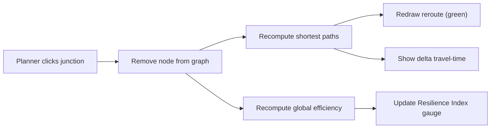

# Dashboard Mockup — Resilience Decision Support

A low-fidelity mockup of the **Phase IV** Streamlit + Leaflet app. This is the
"money shot" of the demo: a planner stress-tests a city in two clicks.

## Layout (ASCII wireframe)

```
+--------------------------------------------------------------------------+
|  ROUTE RESILIENCE        City: [ Bengaluru v ]   Terrain: [ Urban v ]    |
+----------------------------------------------+---------------------------+
|                                              |  RESILIENCE INDEX         |
|            INTERACTIVE MAP (Leaflet)         |     +-----------------+   |
|                                              |     |      0.62       |   |
|     ====O======O==========O=====             |     |   (R, gauge)    |   |
|        |       ||         |                  |     +-----------------+   |
|     ===O======(X)=========O=====   <- flooded|   baseline R = 1.00       |
|        |       ||         |                  |                           |
|     ===O=======O==========O=====             |  GATEKEEPER NODES (top 5) |
|                                              |   1. Jn-014   btw 0.41    |
|   Criticality heatmap:                       |   2. Jn-007   btw 0.33    |
|     red = high betweenness (Gatekeeper)      |   3. Jn-022   btw 0.29    |
|     blue = low                               |   4. ...                  |
|                                              |                           |
|   [reroute path shown in green]              |  CLICKED NODE: Jn-007     |
|                                              |   status: FLOODED         |
|                                              |   delta travel time: +14% |
|                                              |   giant component: -8%    |
+----------------------------------------------+---------------------------+
|  Controls:  [ Click-to-flood ]  [ Reset ]  [ Run flood scenario ]        |
|  Ablation:  static [#### ]   dynamic [######## ]   (efficiency drop)      |
+--------------------------------------------------------------------------+
```

## Interactions

| Control | Effect |
|---|---|
| **Click a junction** | Marks it "flooded" (removed from the graph) |
| **Live reroute** | Affected routes recompute and redraw in green |
| **Δ travel-time** | Shows the cost of the closure as a percentage |
| **Resilience Index gauge** | Updates `R = E(perturbed)/E(baseline)` in real time |
| **Run flood scenario** | Sequenced hazard-grounded ablation (DEM/flood order), betweenness recalculated each step |
| **Terrain selector** | Switch urban → suburban → forested to show generalisation |
| **Static vs dynamic** bars | Ablation proof: dynamic recalculation disrupts more than one-shot removal |

## Mermaid (interaction flow)



## Demo narrative tie-in

1. **Pain:** raw tile + vanilla U-Net → broken mask. *"This graph cannot be routed."*
2. **Fix:** clDice + occlusion model → connectivity-complete mask. *"Now it's routable."*
3. **Product (this dashboard):** click a Gatekeeper Node → live reroute + R drops.
   *"A planner just stress-tested the city in two clicks."*
4. **Scale:** terrain selector holds across urban/forested/rural.
5. **Close:** *"from space insights to stronger cities."*

> Lead with the **decision**, not the architecture. Judges remember "I clicked
> and the city rerouted," not "we used a MiT-B2 encoder."
