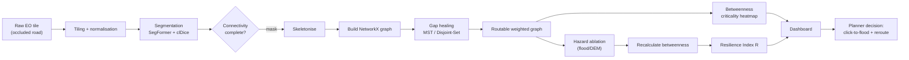

# End-to-End Pipeline Flowchart

The data → decision pipeline, showing what each stage *consumes* and *produces*.

## Mermaid



## ASCII fallback

```
Raw EO tile (occluded)
   -> Tiling + normalisation
   -> Segmentation (SegFormer + clDice)
   -> [connectivity-complete mask]
   -> Skeletonise
   -> Build NetworkX graph
   -> Gap healing (MST / Disjoint-Set, +GNN)
   -> [routable weighted graph]
        |-> Betweenness -> criticality heatmap ----+
        |-> Hazard ablation (flood/DEM)            |
              -> recalc betweenness                |
              -> Resilience Index R ---------------+
                                                   v
                                              Dashboard
                                   (click-to-flood + live reroute)
                                                   v
                                          Planner decision
```

## Stage I/O summary

| Stage | Input | Output |
|---|---|---|
| Tiling | Raw EO scene | 512×512 normalised tiles |
| Segmentation | Tile | Connectivity-complete probability mask |
| Skeletonise | Mask | Pixel skeleton |
| Graph build | Skeleton | NetworkX nodes + weighted edges |
| Healing | Fragmented graph | **Routable** weighted graph |
| Criticality | Graph | Betweenness heatmap (Gatekeeper Nodes) |
| Ablation | Graph + flood/DEM | Sequenced node removal + recalculated betweenness |
| Resilience Index | Efficiency curve | `R = E(perturbed)/E(baseline)` |
| Dashboard | Graph + heatmap + R | Interactive decision support |
