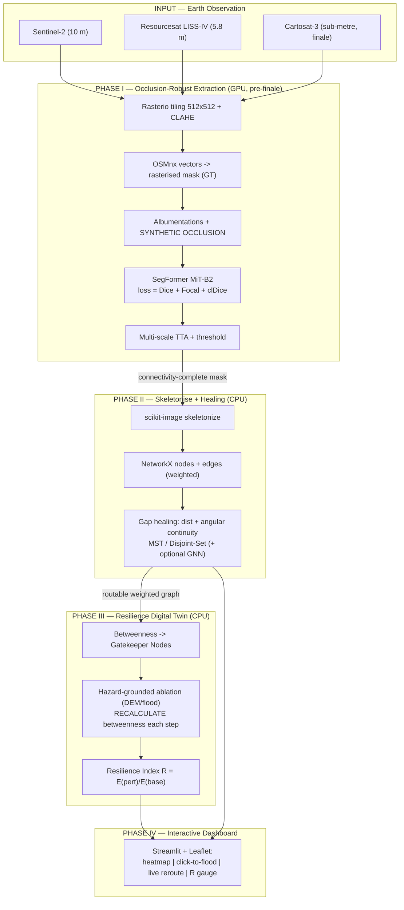

# System Architecture Diagram

End-to-end architecture of **Route Resilience**. Mermaid renders on GitHub, in
VS Code (Mermaid extension), and most Markdown→PDF exporters. An ASCII fallback
follows.

## Mermaid



## ASCII fallback

```
INPUT (EO)            Sentinel-2 10m | LISS-IV 5.8m | Cartosat-3 sub-m
                                       |
                                       v
PHASE I  (GPU)   Rasterio tiling + CLAHE -> OSMnx mask (GT)
                 -> Albumentations + SYNTHETIC OCCLUSION
                 -> SegFormer MiT-B2 [Dice + Focal + clDice]
                 -> multi-scale TTA + threshold
                                       |  connectivity-complete mask
                                       v
PHASE II (CPU)   skeletonize -> NetworkX graph (nodes+edges)
                 -> gap healing (dist + angle) MST/Disjoint-Set (+GNN)
                                       |  routable weighted graph
                                       v
PHASE III(CPU)   betweenness -> Gatekeeper Nodes
                 -> hazard-grounded ablation (DEM/flood), recalc each step
                 -> Resilience Index R = E(perturbed)/E(baseline)
                                       |
                                       v
PHASE IV         Streamlit + Leaflet dashboard
                 heatmap | click-to-flood | live reroute | R gauge
```

**Key property:** only Phase I needs a GPU and it runs *before* the finale.
Phases II–IV are CPU-only, so the system runs end-to-end on a laptop during
integration and the live demo.
