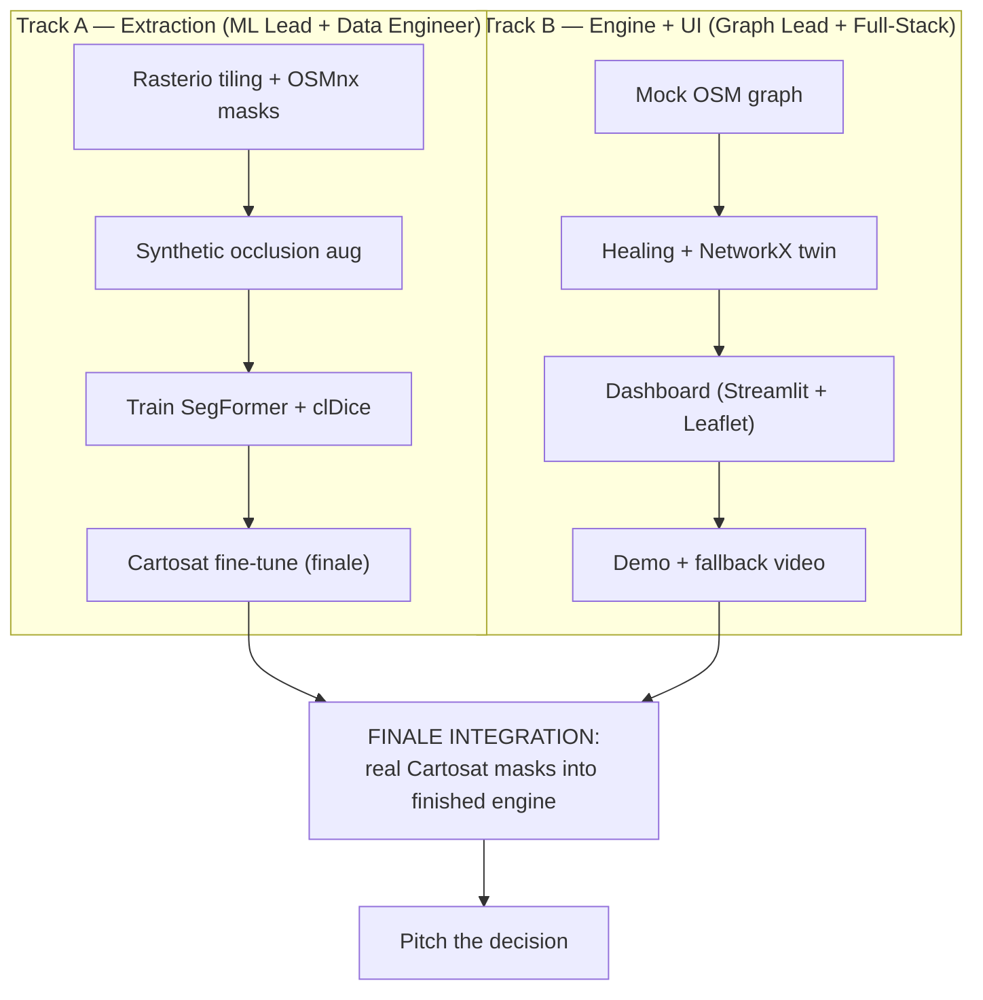
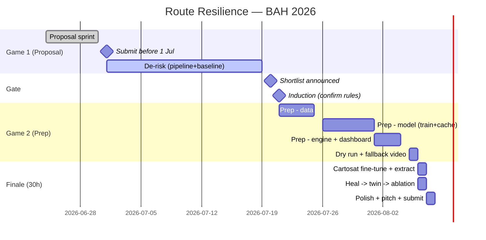

# Workflow Diagram — Team & Timeline

Two views: (1) how the four roles work in **parallel**, and (2) the project
**timeline** from proposal to finale.

## 1. Parallel team workflow



The two tracks run independently because Track B builds against a **mock OSM
graph** — so the dashboard is finished before the real masks arrive, and finale
time is pure integration.

## 2. Project timeline (Gantt)



## ASCII fallback (timeline)

```
24-30 Jun  Proposal sprint ............ SUBMIT before 1 Jul  *
01-19 Jul  De-risk: data pipeline + baseline U-Net
20 Jul     Shortlist gate  *
21 Jul     Induction (confirm GPU / Cartosat / pre-trained weights)  *
21-25 Jul  Prep: data (masks, tiling, occlusion, terrain split)
26 Jul-1 Aug  Prep: train SegFormer+clDice -> cache weights
01-04 Aug  Prep: healing + twin + dashboard on mock OSM graph
05 Aug     Dry run + record fallback video
06 Aug     Finale H0-H10:  Cartosat fine-tune + extraction
06-07 Aug  Finale H10-H22: heal -> graph -> ablation -> R
07 Aug     Finale H22-H30: polish, ablation tables, pitch, SUBMIT  *
```
